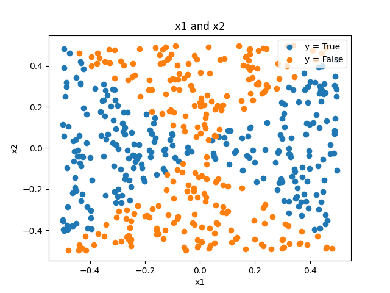
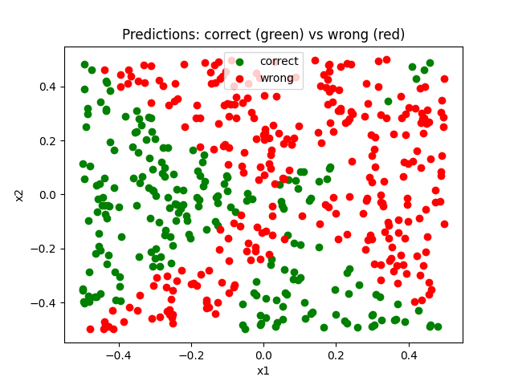

## The Dataset

The dataset is made of 500 observations. There are two predictors, `x1` and `x2`, both following a standard uniform distribution, with a fixed seed, shifted by `-0.5`. The response variable, `y` has two levels: `True` if `x1^2 -x2^2 > 0` and `False` otherwise.

The definition of `y` makes the decision boundary non-linear in the original predictors. The observations are as follows 

By the previous image it is clear that the decision boundary is a parabola.

## Models Used and Results Obtained 

### Logistic Regression 

We first fit the logistic regression classifier on all the data, computing the predictions for that same dataset afterwards. Since no function was applied to the predictors, logistic regression produced, as expected, a linear decision boundary. We assigned the points with colour green if they were correctly classified and the colour red if they were not. The predictions can be found below

The results obtained are very poor with the following confusion matrix 

| Actual \ Predicted | False | True |
|---|---:|---:|
| False | 63  | 184 |
| True  | 101 | 152 |

Hence, the classifier only classified correctly 43% of the observations.

