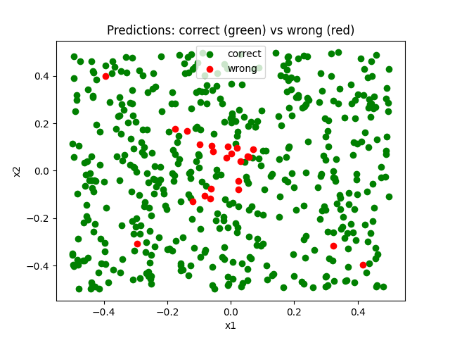

## The Dataset

The dataset consists of 500 observations. There are two predictors, `x1` and `x2`, generated i.i.d from a standard uniform distribution, with a fixed seed, shifted by `-0.5`. The response variable, `y` has two levels: `True` if `x1^2 -x2^2 > 0` and `False` otherwise.

The definition of `y` makes the decision boundary nonlinear in the original predictors. The observations are as follows 

From the previous image it is clear that the decision boundary corresponds to the functions `x2 = |x1|` and `x2 = - |x1|`.

## Models Used and Results Obtained 

### Logistic Regression 

We first fit the logistic regression classifier on all the data, computing the predictions for that same dataset afterwards. Since no function was applied to the predictors, logistic regression produced, as expected, a linear decision boundary. We assigned the points with colour green if they were correctly classified and the colour red if they were not. The predictions can be found below:

The results obtained are very poor with the following confusion matrix:

| Actual \ Predicted | False | True |
|---|---:|---:|
| False | 63  | 184 |
| True  | 101 | 152 |

Hence, the classifier only classified correctly 43% of the observations.

We repeat the experiment, but now considering a polynomial functions of the predictors, namely, `x1^2` and `x2^2`. The results obtained were significantly better, which is expected, as we are now considering a transformation of the predictors that matches the established decision boundary. The decision boundary is now clearly nonlinear as seen in the image below: 

The confusion matrix is:

| Actual \ Predicted | False | True |
|---|---:|---:|
| False | 226 | 21  |
| True  | 2   | 251 |

Hence, the classifier classified correctly 95.4% of the observations.

We repeated the experiment once more by adding to the previous set of predictors the interaction term `x1x2`. Performance increased marginally relative to the model using the squared terms alone, confirming the fact the classification is dominated by the squared terms, reflecting the structure of the underlying decision rule.

The classifications are present in the image below:

The confusion matrix is:

| Actual \ Predicted | False | True |
|---|---:|---:|
| False | 227 | 20  |
| True  | 1   | 252 |

Hence, the classifier classified correctly 95.8% of the observations.

Just to confirm our suspicion that the squared terms are the main drivers of logistic regression’s predictive performance in this setting, we ran one additional experiment using only `x1`, `x2`, and the interaction term `x1x2` (this experiment is not included in main.py). The resulting confusion matrix shows that performance is substantially worse than before:

| Actual \ Predicted | False | True |
|---|---:|---:|
| False | 62  | 185 |
| True  | 101 | 152 |

Only 42.8% of the observations are classified correctly. In fact, adding the interaction term slightly worsens performance compared to using only `x1` and `x2`. This suggests that, for this dataset, the quadratic terms are the most relevant features for capturing the structure of the decision rule.

### Support Vector Classifier 

We fit a Support Vector Classifier (SVC) on the observations with a standard value of 1 for the regularization parameter. Since the decision boundary obtained by this classifier is linear, the results are not much better when compared to the first experiment with logistic regression. The confusion matrix is as follows:

| Actual \ Predicted | False | True |
|---|---:|---:|
| False | 0   | 247 |
| True  | 0   | 253 |

And the method only classified correctly 50.6% of the observations. This value, likewise for the logistic regression, can be explained by the X shape of the decision rule, and so the best separating hyperplane can only capture correctly around half of the observations.

Although our suspition lies that the best results for this method will come for a nonlinear support vector machine with a polynomial kernel of degree 2. We still try to obtain, via cross-validation, a better value for `C`.   

We perform 5-fold cross-validation for `C` with the values `0.001, 0.01, 0.1, 1, 5, 10, 100`; and the best result comes for `C = 0.001, 0.01, 0.1, 1`, so the change in `C` does not affect the performance.

Following this, and since we can use polynomial kernels, there is no need to manually apply nonlinear transformations to the predictors. We therefore fit an SVM , with the value of `C = 1`, with a degree-2 polynomial kernel. 

By following this approach, our results improve, obtaining the following:

| Actual \ Predicted | False | True |
|---|---:|---:|
| False | 239 | 8 |
| True  | 2   | 251 |

That is, the classifier correctly predicted 98% of the observations, outperforming the logistic regression model that relied on a manually transformed predictor space. This improvement is consistent with a setting in which the classes are well separated, making the classification boundary clear and the observations easy to distinguish. In such cases, an SVC can outperform logistic regression.

